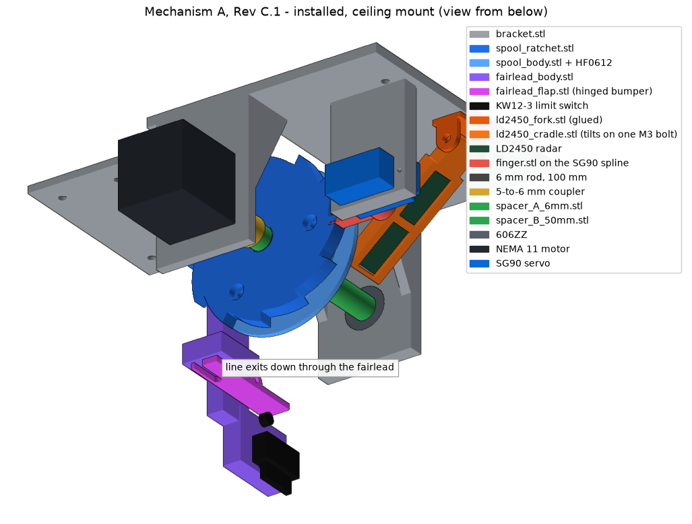

# dropspider-inline

**DropSpider, Mechanism A: In-Line Single-Axle Clutch Spool (ISCS), Rev C.1.**
A ceiling-mounted Halloween prop that drops a foam spider 0.5 to 1.2 m when someone walks toward a doorway, then winds it back up and re-arms on its own. Zero power while waiting.

Sibling project name reserved: `dropspider-tiltspool` (Mechanism B, servo-driven tilt-spool free-fall). Not started. This repo is Mechanism A only.

## How it works

Stepper motor to coupler to 6 mm rod. The spool rides the rod on a one-way clutch bearing. On a drop, the motor spins fast in the unwind direction and the spool runs down behind it; the clutch lets the spool lag but never overrun, so the motor sets the drop speed and the stopping height. On rewind the clutch locks and the motor winds the spider home, where the line's stop bead lifts a hinged flap under the fairlead and clicks a limit switch. A servo-driven finger in a ratchet then holds the spool with no power. An LD2450 radar at the door fires only on people walking toward it, timed so the spider arrives as they reach the doorway.

## Repo map

| Path | What |
|---|---|
| `docs/01_mechanical_design.md` | design spec, stack-up, lock mechanism, direction rules, print settings |
| `docs/02_electrical.md` | pin map, power, driver setup, logic-level check |
| `docs/03_sensor.md` | LD2450 (primary) and LD2410C (fallback): placement, trigger rule, app check |
| `docs/04_firmware.md` | cycle, serial commands, rewind math |
| `docs/05_assembly.md` | step-by-step assembly with pictures |
| `docs/06_installation.md` | doorway geometry, heights, fastening, safety |
| `docs/07_commissioning.md` | bench and on-site test checklist with pass criteria |
| `docs/08_open_items.md` | what is verified, what is not, risks |
| `docs/09_fairlead_switch.md` | fairlead, hinged flap and KW12-3 limit switch |
| `docs/M1_fix_handoff.md`, `docs/handoff_sensor_bearings.md` | Rev C.1 owner handoffs: clutch fix and motor-led drop; LD2450 and bearing care |
| `cad/generate.py`, `cad/fairlead.py` | source of truth for every printed part (`tools\regen_cad.ps1` rebuilds STLs and images) |
| `cad/stl/` | print-ready files. `cad/retired/` holds obsolete parts: do not print |
| `platformio.ini`, `src/`, `include/` | firmware, standard PlatformIO layout, 38-pin ESP32-S NodeMCU |
| `secrets.ini.example` | template for `secrets.ini`: WiFi name, password, update password (never committed) |
| `docs/commissioning_log.md` | every bench and install result, dated |
| `bom/BOM.csv` | every part, ordered or still to buy |
| `scripts/update_firmware.bat` | double-click to update the firmware, by WiFi or by USB |
| `tools/esptool_noreset.py` | USB flashing helper the update script uses |
| `tools/console.py` | send console commands over USB or the network, print the replies |
| `tools/requirements.txt` | Python packages for the tools |
| `tools/*.ps1` | same as the .bat files for PowerShell; regenerate CAD and images |

## Quick start

1. Print the parts in `cad/stl/` (settings in doc 01).
2. Buy the "TO BUY" lines in `bom/BOM.csv`.
3. Assemble per doc 05.
4. Wire per doc 02. Set buck to 5.0 V and driver Vref to 0.85 V first.
5. Copy `secrets.ini.example` to `secrets.ini` and put in your WiFi name and password.
6. Plug the board in by USB, double-click `scripts\update_firmware.bat`, pick 2 (USB), then run doc 07 on the bench.
7. From then on, the web page at `http://dropspider.local` is the console, and firmware updates go over the network (doc 04).
8. Install per doc 06.
