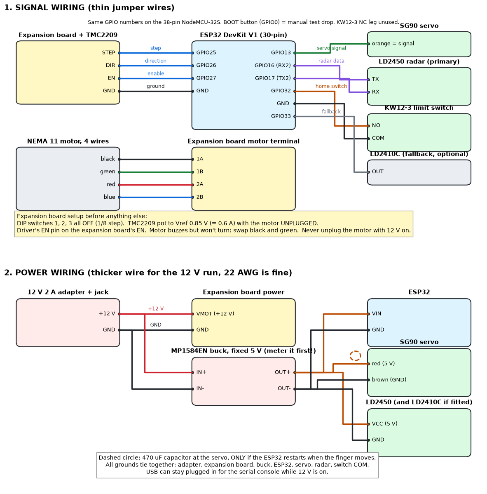

# 02 - Electrical

## Pin map, 30-pin ESP32 DevKit V1 (board in use)

Board: 30-pin ESP32 DevKit V1, ESP-WROOM-32 module, CP2102 USB chip, PlatformIO board `nodemcu-32s`. The 38-pin NodeMCU-32S uses the same GPIO numbers and works unchanged; go by the name printed beside each pin, not its position. The 5 V input pin is marked VIN on the 30-pin board and 5V on the 38-pin.

| ESP32 pin | Goes to | Direction | Notes |
|---|---|---|---|
| VIN | buck OUT+ (5.0 V) | power in | Do not feed 12 V here |
| GND (any) | common ground | - | All grounds tie together |
| GPIO27 | expansion board DIR, S row | out | Rewind direction set in firmware |
| GPIO26 | expansion board STEP, S row | out | One pulse = 1/8 motor step |
| GPIO25 | expansion board EN, S row | out | LOW = motor powered, HIGH = coils off (free) |

D27, D26, D25 sit side by side on the ESP32 header in the same order as the expansion board's DIR, STEP, EN columns, so one 3-wire ribbon goes across straight (changed 2026-10-01; before then STEP was GPIO25, DIR 26, EN 27).
| GPIO13 | SG90 orange | out | Not GPIO14: 14 pulses during boot and twitches the finger |
| GPIO33 | LD2410C OUT (fallback only) | in | HIGH = someone present. Firmware adds a pull-down. Used only with `sensor 2410` |
| GPIO32 | KW12-3 limit switch NO leg (COM to GND) | in | In the fairlead (doc 09). Pressed = bead lifting the flap. Firmware adds a pull-up |
| GPIO16 (RX2) | LD2450 TX (yellow wire) | in | Primary trigger, UART2 at 256000 baud |
| GPIO17 (TX2) | LD2450 RX (green wire) | out | Primary trigger |
| GPIO0 | on-board BOOT button | in | Press = manual test drop. Not on the 30-pin header; nothing to wire |
| GPIO2 | on-board LED | out | Slow blink = armed and ready |

## Driver: BIGTREETECH TMC2209 V1.3 on the A4988/DRV8825 expansion board

- Plug the driver in with its **EN** pin on the expansion board's **EN** position. Backwards destroys it on power-up.
- DIP switches 1, 2, 3 all **OFF**. On a TMC2209 that is 1/8 microstep (each STEP pulse moves 1/8 of a full step) and leaves the UART pin (the driver's serial setup line, unused here) alone.
- Current: turn the driver's pot until the voltage from the pot's metal top to GND reads **0.85 V** (= 0.6 A, 90 percent of the motor's 0.67 A). Do this with 12 V on and the **motor unplugged**. Factory default is about 1.2 V, too high for this motor.
- STEP/DIR/EN only. UART is not wired; the expansion board does not bring that pin out.
- The expansion board's DIR, STEP and EN columns each have three pins, S, V, G. The ESP32 wire goes on **S** (signal). One wire from an ESP32 GND to any **G** (the G pins are all joined). Leave every **V** empty.

## Power

| Rail | Source | Loads | Worst case |
|---|---|---|---|
| 12 V | 12 V 2 A wall adapter | driver/motor, buck input | about 0.6 A while rewinding (about 3 s per scare), about 0.05 A idle |
| 5 V | MP1584EN mini buck, fixed 5 V (not adjustable). Meter its output on 12 V **before** connecting anything | ESP32 (0.25 A peak, WiFi on), SG90 (0.7 A stall peak), LD2450 (about 0.1 A), LD2410C if fitted (0.08 A) | about 1 A peak; the MP1584EN is comfortable to about 1.5 A |

- 470 uF 16 V electrolytic across the servo's red and brown: **only if** the ESP32 restarts when the finger moves (the page's "Running for" clock resets). A micro servo moving for a fraction of a second on the buck's output does not normally need it. If fitted: at the servo end, stripe to GND.
- Idle draw between scares is a few watts at most: driver disabled, servo detached, radar and ESP32 on.
- USB can stay connected to a PC for the console while 12 V is on.
- Ceiling install: run 12 V up with a 5.5 x 2.1 mm DC extension cable. Keep the adapter at the outlet, never at the ceiling.

## Logic-level check (V1, required before first motor run)

The expansion board powers the driver's logic side from its own 5 V regulator, and the ESP32 drives STEP/DIR/EN at 3.3 V. Most TMC2209 boards accept that, but it is not guaranteed.

Test: with the motor connected, run `jog 1600` from the console. The motor must make exactly one smooth turn. Then `jog -1600`, one turn back.

If it stutters, misses, or does nothing while the driver clearly holds (shaft stiff): add a 74AHCT125 (or any 5 V buffer with 3.3 V-compatible inputs) powered from the 5 V rail between ESP32 and expansion board on STEP, DIR, EN. Wiring: ESP32 pin to buffer input, buffer output to expansion board, buffer enable pins to GND.

## Motor wiring

STEPPERONLINE NEMA 11, 11HS12-0674S (0.67 A, 5.6 ohm per coil): black (A+) + green (A-) = coil A, red (B+) + blue (B-) = coil B. Meter check: black to green and red to blue each read about 5.6 ohm; any other pair reads open. Black to 1A, green to 1B, red to 2A, blue to 2B. The leads come bare: put a female jumper end on each (half of a female-to-female jumper, joint soldered or twisted and covered, joints staggered) and push them onto the expansion board's motor pins. If the motor buzzes but will not turn, swap black and green. Never plug or unplug the motor with 12 V on.

## Limit switch wiring (KW12-3 in the fairlead)

The KW12-3 roller switch is built into the fairlead (doc 09). On rewind the stop bead lifts a hinged flap, the flap's tail presses the roller, and the firmware stops the motor the moment it closes.

Bare switch, three legs: **COM to GND, NO to GPIO32, NC unused.** No power wire. On the switch in hand, from the lever's hinge end the legs are COM, NO, NC (read off the part 2026-09-25). Meter check: the leg that beeps to one other leg at rest and to the third with the lever held is COM.

Open = HIGH, pressed = LOW with the firmware's pull-up. Check with the web page by lifting the flap by hand; if it reads backwards, `liminv 1`. Then `limit 1` turns it on. Keep the lead away from the motor wires, or twist its signal and ground together. Inverted install (doc 06): the switch and the radar sit under the base and the board on top, so their leads run round the base's far (servo) end, about 15 cm for the switch and 25 cm for the radar, tied clear of the spool.

By design the switch reads **open** at rest after the lock seat (doc 09, V14): the seat move lets the bead drop off the flap.

## Sensor wiring

**LD2450 (primary):** 5 V, GND, TX to GPIO16, RX to GPIO17. The owner's cable (2026-10-01), colours at the sensor: **red 5 V, black GND, yellow TX (to GPIO16), green RX (to GPIO17)**. TX goes to RX and RX to TX: yellow is the sensor's transmit, so it lands on the ESP32's receive. 4-pin, 1.25 mm plug at the sensor. No OUT pin. See `03_sensor.md`.

**LD2410C (fallback, optional):** 5 V, GND, OUT to GPIO33 (3.3 V output, goes straight in). Used only with `sensor 2410`.
