# 05 - Print and assembly

Time: about 5 h printing, 1 h assembly. Tools: small Phillips, 1.5 mm and 2 mm hex keys (coupler set screws), multimeter, vise or bar clamp, CA glue, blue threadlocker, hair dryer.

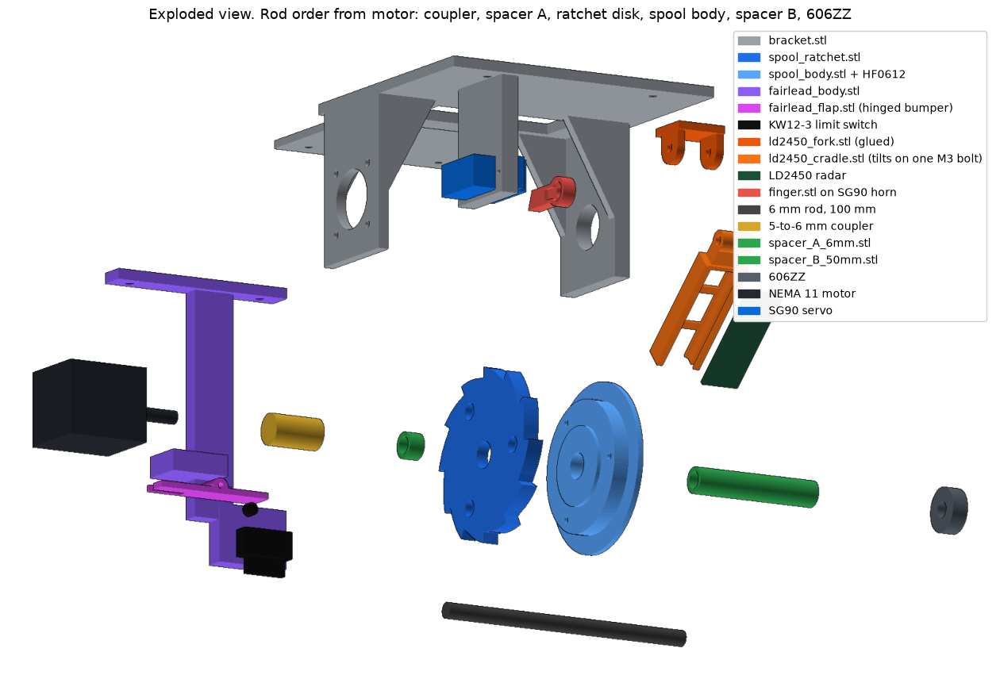

## A. Print

All PLA except the finger (PETG if you have it). Settings table in `01_mechanical_design.md`. Minimum set: 1 of each part. Spares worth printing: 1 extra finger, 1 extra flap. Shims only if step 8 calls for them.

## B. Sub-assemble the spool

1. Stack before the bearing goes in: `spool_shield` (the flat 64 mm disc, either face) on the flat face of `spool_body`, then `spool_ratchet`, its flat face (no counterbores) on the shield. Line up the three screw holes and drive **3x M3x8** into the body. Snug, do not strip. The three must sit flat on each other with no gap at the rim. Then press the **HF0612** in from the flange side, through all three 10.3 mm holes, until it is flush with the flange.
2. Check its direction now: push a spare piece of the 6 mm rod in, hold the rod, and spin the body. It must spin freely one way and lock the other. Mark the free direction on the flange with a marker.
3. Check the stack again: no gap at the rim anywhere round. If there is one, back the screws off, scrape any lip off the hole edges, and tighten again.
4. Look at the spool from the **ratchet disk side** (this side faces the motor, so this is the view from behind the motor). The free direction marked in step 2 must be **clockwise** from this side, so it locks counterclockwise (Rev C.1; Rev C had this backwards). If not, press the bearing out and flip it.
5. Tie the **6 lb monofilament** straight to the barrel with an arbor knot (the knot anglers use on a reel spool), between the flanges, a drop of CA on the knot. No elastic, no braid.

## C. Frame and rod

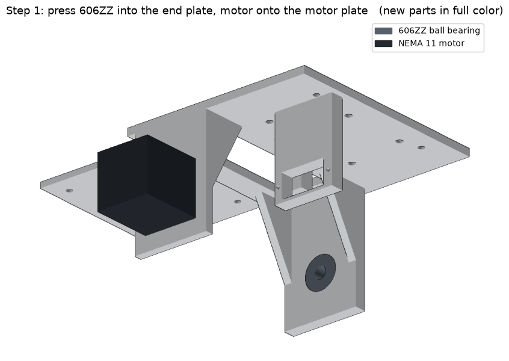

6. Press the **606ZZ** into the end plate. If it goes in loose (a seat softened by heating the bearing, or an older bracket), fit `bearing_retainer` on the end plate's outside face: drill two 2.5 mm pilots through the end plate using the retainer's holes as the guide, then 2x M3 x 6 to 8. The rod passes through its 14.5 mm hole and sticks out past it by about 14 to 17 mm; that is expected. Screw the **NEMA 11** to the outside of the motor plate, 4x M2.5x6, wires pointing toward the base.

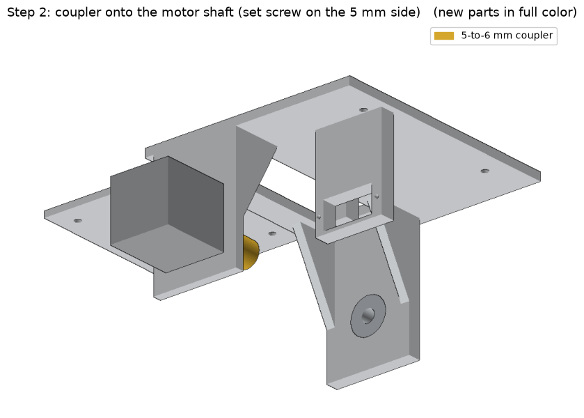

7. Slide the **coupler** onto the motor shaft, 5 mm side, until the shaft stops. Blue threadlocker, tighten that set screw. Leave the 6 mm side loose.

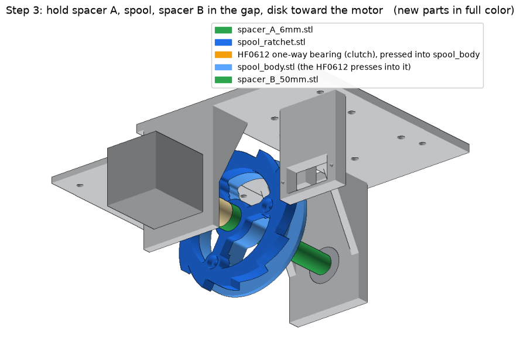

8. Measure from the motor plate's outer face to the free end of the coupler. **30 mm:** use `spacer_A_6mm`. **26 mm:** use the old 10 mm spacer A if you have one. **27 to 29 mm:** `spacer_A_6mm` plus `shim_1mm` / `shim_2mm` to make up the difference. **Over 30:** sand spacer A down by the difference.
9. Hold, in line inside the frame: spacer A (next to the coupler), the spool (ratchet disk toward the motor), spacer B. **Owner's build (2026-09-29):** snug but not tight took about **4 mm of shim on the motor side of the spool** and **5 mm on the 606ZZ side**. Stack to fit your own frame the same way, then check the ratchet disk still sits between the finger's faces.

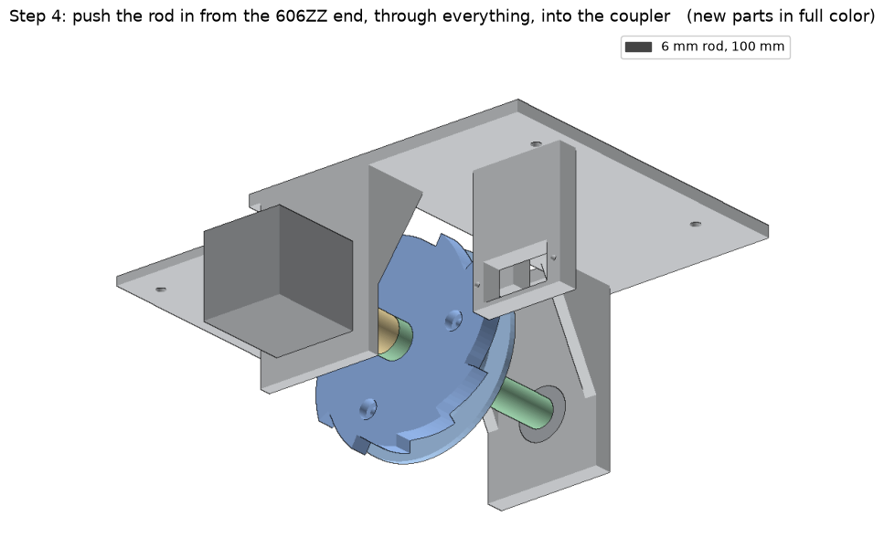

10. Push the **6 mm rod** in from the outside of the 606ZZ plate: through the bearing, spacer B, spool (rotate the spool its free way as the rod enters the needles), spacer A, into the coupler until it bottoms. Blue threadlocker, tighten the 6 mm set screw.
11. Check: the spool spins freely by hand clockwise (seen from behind the motor), and turning it counterclockwise drags the motor shaft round with it. The stack is snug with no end play above 0.5 mm.

## D. Servo and finger

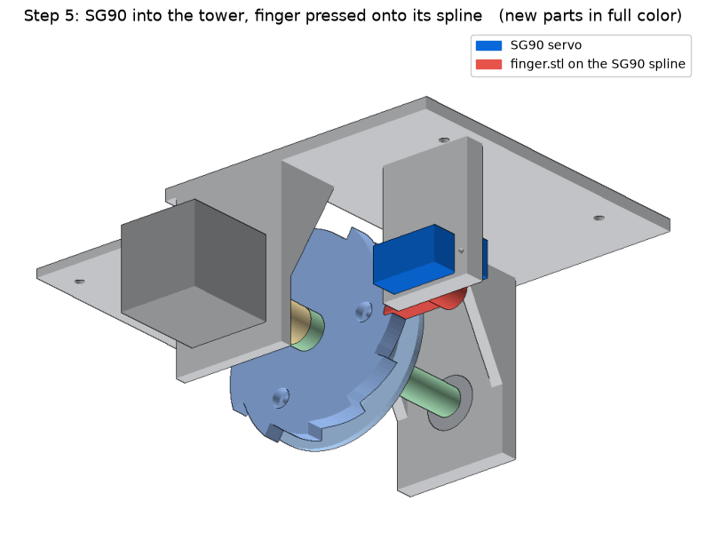

12. Drop the **SG90** into the tower pocket from the 606ZZ side, output spline toward the spool, wires out the far end. Two tab screws.
13. Power the servo (or do this at commissioning): send it to 90 degrees. No horn is used.
14. Press the **finger's hub** straight onto the servo spline, pointing at the rod, level, resting just above the ledge, tip in the teeth. The socket is round, so it goes on at any angle. Push until the spline bottoms in the socket, then drive the horn screw in from the top, down the 7.4 mm recess. If it is loose on the spline, a drop of CA in the socket; if too tight to push on, turn a 5 mm drill through the socket by hand. Check edge-on: the 7 mm finger covers the 6 mm ratchet disk; at least 5 mm must overlap. If not, move the disk with spacer A and the shims (step 8).

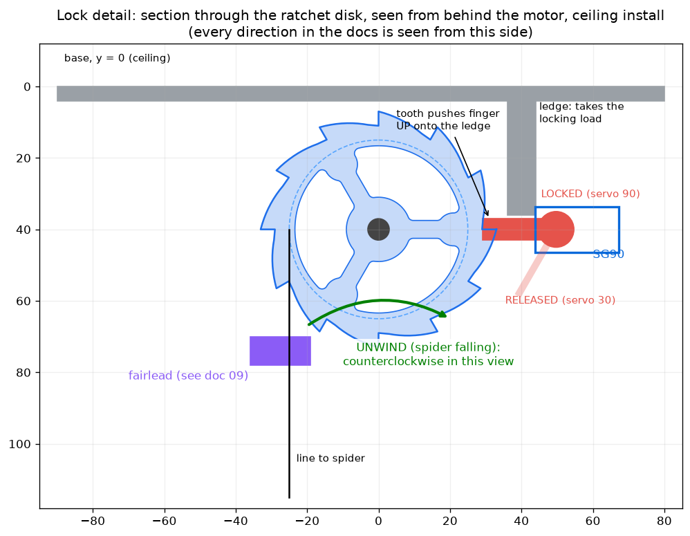

## E. Fairlead, limit switch and line

One `fairlead_body` and one `fairlead_flap` per build. Full detail in `09_fairlead_switch.md`.

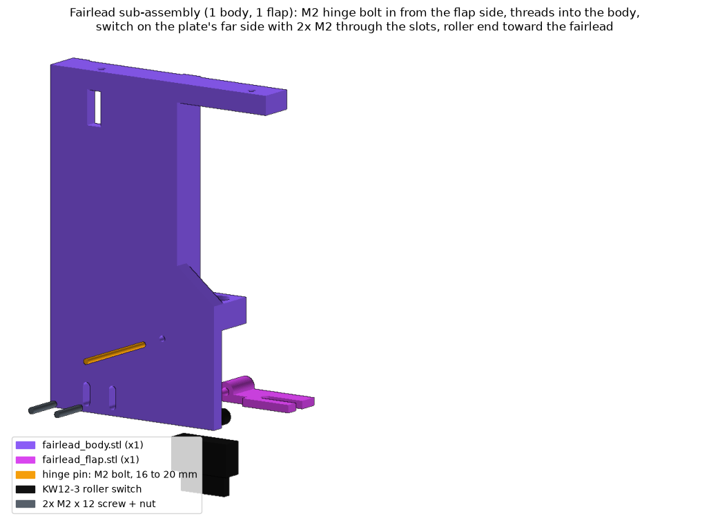

15a. Clear the fairlead bore with a 3 mm drill turned by hand. A scrap of the line must slide through without catching.
15b. KW12-3 switch onto the switch plate: roller end toward the fairlead, body on the side away from the flat back. 2x M2 x 12 through the slots, nuts on the switch side, finger-tight.
15c. Flap knuckle into the gap under the fairlead. Hinge pin: an **M2 bolt, 16 to 20 mm**, in from the flap's outer side: free through the flap (open the flap's hole with a 2.5 mm drill by hand if it drags), then it cuts its own thread into the body's hole. Stop before the head clamps the flap. Check the flap swings down under its own weight.
15d. Flap level on its rest stop: slide the switch up until the roller just touches the flap's tail, back off a paper's thickness, tighten. Lift the flap's free end by hand: click at about 2 mm, then it stops flat against the fairlead.

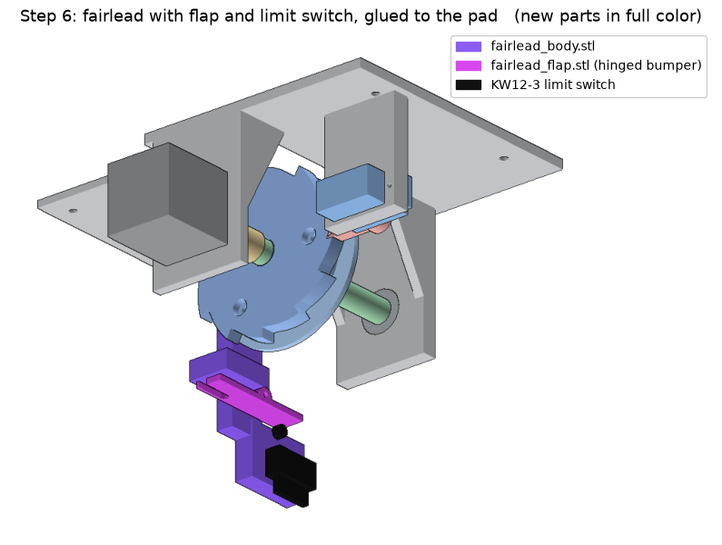

15. Screw `fairlead_body` to the pad: 2x **M3 countersunk (flat-head) screws, 8 to 10 mm**, put in from the ceiling side down through the x = -32 pad holes, heads flush with the ceiling face, cutting their own thread into the fairlead's rail (2.5 mm pilots). No glue (owner 2026-09-26). The pad holes need a 90 degree countersink so the heads sit flush: new bracket prints have it; on an already printed bracket, twist an 8 mm drill bit by hand in each of the two holes from the ceiling side until a screw head sits flush or just below.
16. Wind the line onto the spool by turning it clockwise (seen from behind the motor). The free end leaves the spool on the pad side; thread it down through the fairlead, then slide it into the flap's slot from the flap's free end.
17. Below the flap, in order: **8 mm bead** (slides on the line; this is what lifts the flap), **barrel swivel** (tie the line to it with an improved clinch or palomar knot; the bead rests on it), **spider** tied to the swivel's other end.
18. Unwind fully and measure from the barrel knot to the bead, line straight but not pulled. That is the `line` value for the firmware.

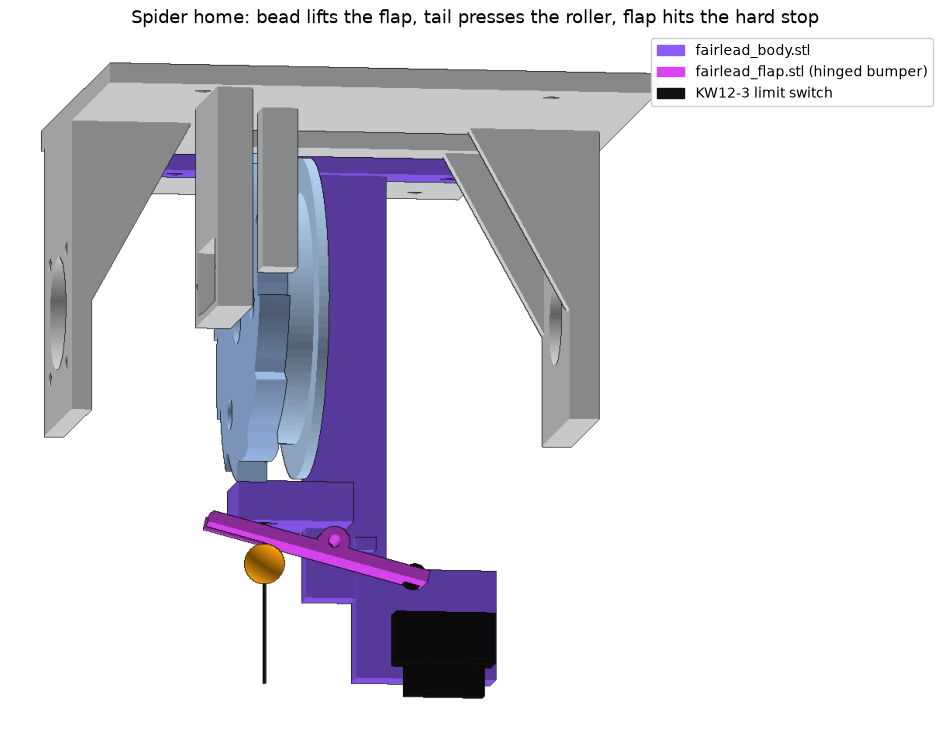

## F. Electronics

19. Meter the 5 V buck (MP1584EN, fixed, not adjustable): 4.95 to 5.05 V before connecting any loads.
20. Set the TMC2209 Vref to 0.85 V, motor unplugged. DIP switches all OFF.
21. Wire per `02_electrical.md` (LD2450 on GPIO16/17, KW12-3 NO to GPIO32 and COM to GND). Mount the controller board on the pad with foam tape or zip ties through the x = -80 holes. Keep the x = -56 holes and the two at the servo end clear: they are the ceiling screw holes.
22. Go to `07_commissioning.md` before mounting anything overhead.

## G. Inverted install only (device turned over on the beam's face, doc 06)

23. Bracket printed from 2026-09-28 on: the five holes are already there, skip to 24. Older print: drill the base: 7 mm at x 25, z 45 (the line; a 1/4 in bit is close enough), 3.4 mm at x 32, z 28 and z 83 (the fairlead block), 3.4 mm at x 62, z 45 and z 79 (the radar fork). Print `cad/bracket_footprint_inverted.svg` at 100% as a template. Sand the 7 mm hole smooth. The brace bolt holes are the owner's; doc 06 says where they can go.
24. Print `fairlead_base.stl` instead of `fairlead_body.stl`. Fit the flap and switch to it as in steps 15a to 15d, then screw it under the base with 2x M3 x 12 from inside the base.
25. Bolt `ld2450_fork_screw.stl` under the base at the servo end, plate against the base, ears hanging down: 2x M3 x 10 up through the fork and the base, nuts inside. No glue. Cradle on one M3 bolt through the fork's ears, radar slid into the cradle (doc 03), looking back toward the pad end and down, 50 degrees to start.
26. Wind the line clockwise (seen from behind the motor) as in step 16, but lead it off the spool's **servo side**, down through the base hole, the block's bore and the flap's slot.
27. Leads: the switch and radar leads go round the base's far (servo) end and back along the top to the board (about 15 and 25 cm), tied to the base clear of the spool.
28. The braces and their holes are the owner's. Then `07_commissioning.md` as usual.

## Base layout reference

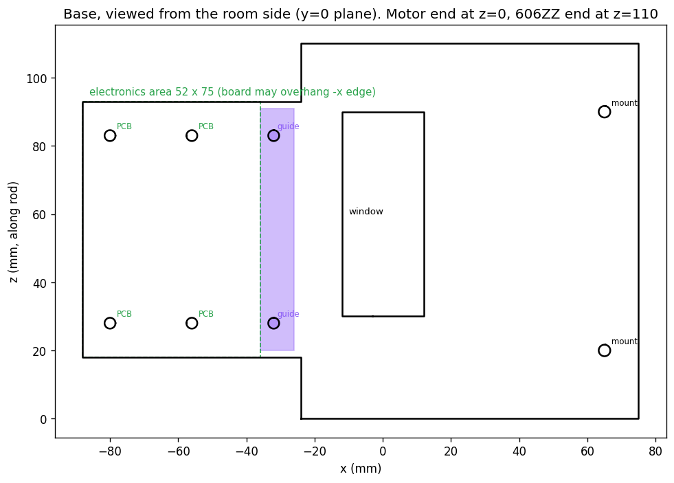
