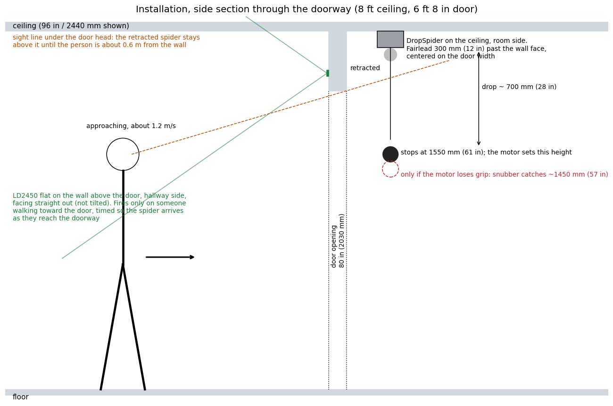
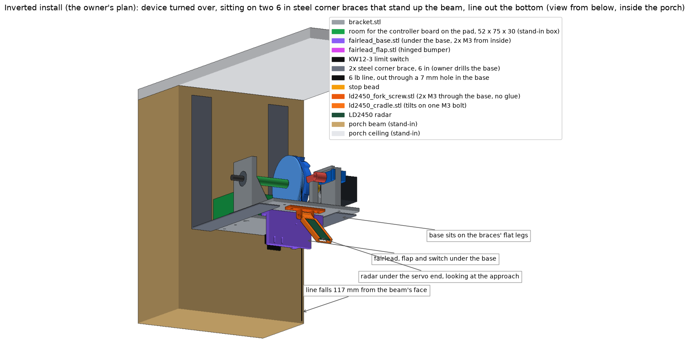

# 06 - Installation under the porch

## Where it goes

Porch measured by the owner 2026-09-26: ceiling 8 ft, front beam hangs 10 in below it, device 12 in behind the beam.

- **On the porch ceiling, behind the front beam.** People walk in from outside, under the beam.
- Spider line (the fairlead) **305 mm (12 in) behind the beam's back face**, centred on the walkway.
- Rod axis parallel to the beam. **Servo end, with the radar, toward the beam**; the fairlead end away from it.
- The device hangs about 112 mm below the ceiling at its lowest point (the limit switch). Retracted, the spider's bottom sits about 215 mm below the ceiling, above the beam's bottom edge (254 mm below the ceiling), so the beam hides it until the person is close.
- **Radar tilt 50 degrees down** for this porch. The beam blocks every radar ray shallower than about 45 degrees down; at 50 the middle of the radar's beam passes under it. Worked out from the measurements (drawn in the picture): legs visible from about 1.7 m outside the beam, chest from about 0.8 m. Not yet walk-tested (test S3). Radar partly sees through wood too; the walk test settles it.

## Heights (8 ft porch ceiling, beam 10 in deep)

| Point | Height |
|---|---|
| Porch ceiling | 2440 mm (96 in) |
| Bottom of the front beam | 2184 mm (86 in) |
| Spider, retracted | bottom of spider about 2230 mm, hidden above the beam's bottom edge |
| Spider at rest after the drop | 1550 mm (61 in): face height for teens and adults, above small children |
| Lowest point if the motor loses grip and the line's stretch catches it | about 1450 mm (57 in) |

Line length to set (barrel knot to bead) = (ceiling - 85 mm) - (target rest height + spider height + 30 mm for bead and swivel) + 45 mm.
The 85 mm is where the bead sits against the flap at home; the 45 mm is line between the spool and the flap.
For the table above with a 100 mm spider: 2355 - 1680 + 45 = 720 mm. Tie it at 720, enter `line 720`, then shorten on site until the resting height is right.

## Fastening

- 4 screws: the 2 holes at the servo end and the 2 pad holes at x = -56 (the middle pair).
- Into a joist: #4 x 1 in pan-head wood screws.
- Into drywall only: #4 screws in ribbed plastic anchors, or small toggle anchors. With 6 lb mono the peak pull is about 12 N (1.2 kg) and can never pass about 27 N, where the line snaps. Never hang it on braid without an elastic snubber.
- The ceiling face must be flat against the base; nothing may stick out of the ceiling side (this is why the fairlead's two screws are countersunk flush).

## Alternative: turned over on the beam's inside face (inverted install)

The owner's plan, approved 2026-09-27: the device turned upside down, its flat base at the bottom, sitting on two steel corner braces screwed to the beam's inside face. The line leaves through a hole in the base. Every load (the device's weight, the line's pull) presses the printed parts down into the base and the base onto steel, instead of hanging the PLA from screws. CAD-checked, **not yet built or hung** (open item V18). Source `cad/inverted.py`; run it for the report.

**What changes on the device.** Nothing in the mechanism or the firmware: same spool, clutch, ratchet, finger, servo, same winding sense, same `dir`. The line simply leaves the barrel on the servo side instead of the pad side (doc 01, direction rule 1).

| Part | What happens to it |
|---|---|
| Bracket | Reused. Three holes drilled through the base (drawing `cad/bracket_footprint_inverted.svg`, 1:1): **5 mm for the line** at x 25, z 45; **3.4 mm x2 for the fairlead block** at x 32, z 28 and z 83 |
| `fairlead_base.stl` (new, 18 cm3) | The fairlead, hard stop, rest stop and switch plate of doc 09 as one block under the base, at the line hole. Same flap (`fairlead_flap.stl`), same KW12-3, same hinge bolt. 2x M3 x 12 from inside the base (heads on the device side) into the block's 2.5 mm pilots. Replaces `fairlead_body.stl` for this install |
| Radar | Stays on the device: the same `ld2450_fork.stl`, cradle and radar, turned over and glued under the base at the servo end, looking back toward the beam (where people come from) and down at 50 degrees |
| Controller board | Unchanged: on the pad, the base's device side at the beam end, now facing up. Room checked: a 52 x 75 x 30 mm box there clears every part |
| Braces | **The owner's:** two steel corner braces, 6 in legs. The flat leg under the base, the other leg standing up the beam's face beside the device. He places them and drills the base for their bolts himself (drawn in the model at the base's two ends, z 8 and z 106, clear of the fairlead block; nearer the middle they hit it) |

**Heights**, from the model, with 6 in braces standing up the beam with their tops about 8 mm under the ceiling:

| Point | Below the ceiling |
|---|---|
| Base (the device's bottom face) | 160 mm |
| Bead at home, against the flap | about 179 mm |
| Spider retracted, bottom | 179 + 30 (bead and swivel) + spider height. Hidden behind the 254 mm beam only for a spider up to about 45 mm tall |
| Line | falls 117 mm from the beam's face (ceiling install: 305 mm) |

Line length (barrel knot to bead) = (ceiling - 179) - (target rest height + spider height + 30) + 55. The 55 mm is line from the spool to the flap in this layout. Tie it, enter `line`, then shorten on site, as for the ceiling install.

**Radar view**, from the model: the device blocks none of the radar's field (60 degrees either side, 35 up and down); its centre line meets the beam's face plane 403 mm below the ceiling, under the beam's bottom edge (254). The radar hangs about 30 mm past the base's far end. The spider, retracted or dropped, is inside its view: if the radar reports the spider as a person, the device would sit in "waiting for the doorway to clear" after each scare. Not checked; the first walk test (S3) shows it, and a steeper or shallower tilt moves the spider out of the middle of the view.

**Order.** Bench: drill the three holes, screw the fairlead block on (doc 09, inverted install), glue the radar fork under the servo end, board on the pad, line threaded down through the base hole. Ladder: braces to the beam, device onto their flat legs, bolted through the owner's holes. Then `07_commissioning.md` as usual.

The hinge-and-strut wall draft (`cad/wall_hinge.py`, `hinge_plate.stl`, `hinge_clip.stl`, `tie_bar.stl`, `strut.stl`) and the braced shelf (`cad/wall_mount.py`) are superseded by this and kept for reference only. Do not print them.

## Sensor

- Outdoors under a covered porch: keep the device and controller out of blowing rain; the LD2450 and the electronics are not waterproof.

- **LD2450** (primary): on the device, in its tilting cradle under the servo end (`ld2450_fork.stl` glued, `ld2450_cradle.stl` on one M3 bolt), looking out from under the porch toward people walking in, standing upright. Set the tilt on site, starting at 20 degrees down (doc 03). Nothing to mount on the wall. Inverted install: the same parts glued under the base's servo end, see above.
- Its lead (4 wires, 1.25 mm plug at the sensor) runs about 10 cm across the device to the controller.
- Setup per `03_sensor.md`: no calibration needed; optional app check for firmware version and tracking; leave the app's zones off.
- LD2410C (fallback only): top center of the opening, hallway side, aimed about 45 degrees down; settings in `03_sensor.md`.

## Power

- 12 V adapter at the outlet, 5.5 x 2.1 mm DC extension cable up to the ceiling. Tape the cable along the door trim.

## Safety

- Soft foam spider only, 60 g maximum, no hard eyes or wire legs at face height. Legs wider than about 50 mm may touch the limit switch at the top; trim or angle them down.
- Keep the drop clear of stairs, and of the swing of the door itself.
- 6 lb monofilament only (or put the elastic snubber back). Check the knots, the bead, the flap, and the line for nicks before each night.
- `disarm` (or unplug) when small children are expected to run through.
