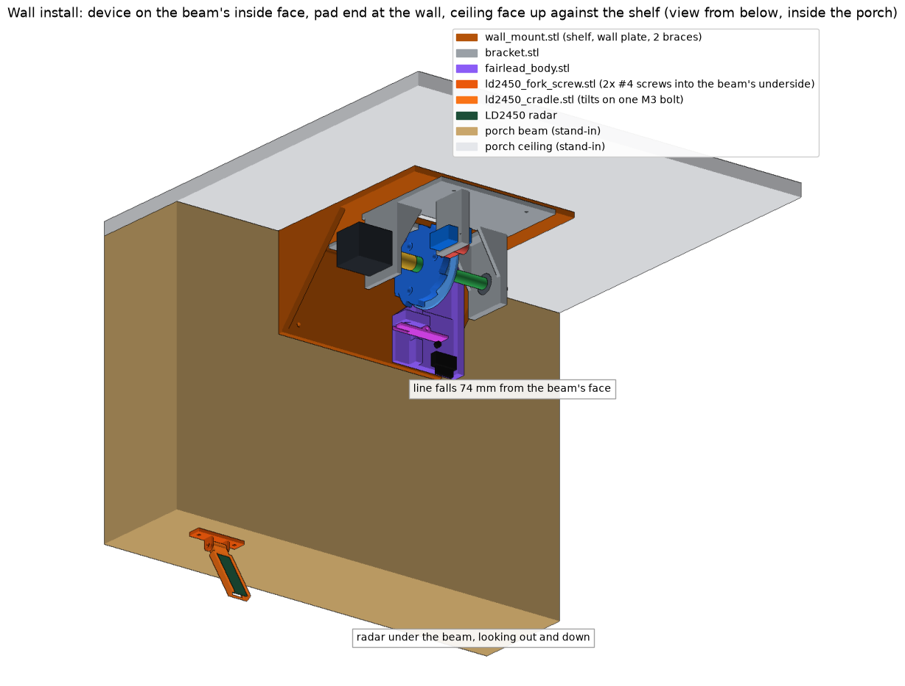

# 06 - Installation under the porch

## Where it goes

Porch measured by the owner 2026-09-26: ceiling 8 ft, front beam hangs 10 in below it, device 12 in behind the beam.

- **On the porch ceiling, behind the front beam.** People walk in from outside, under the beam.
- Spider line (the fairlead) **305 mm (12 in) behind the beam's back face**, centred on the walkway.
- Rod axis parallel to the beam. **Servo end, with the radar, toward the beam**; the fairlead end away from it.
- The device hangs about 112 mm below the ceiling at its lowest point (the limit switch). Retracted, the spider's bottom sits about 215 mm below the ceiling, above the beam's bottom edge (254 mm below the ceiling), so the beam hides it until the person is close.
- **Radar tilt 50 degrees down** for this porch. The beam blocks every radar ray shallower than about 45 degrees down; at 50 the middle of the radar's beam passes under it. Worked out from the measurements (drawn in the picture): legs visible from about 1.7 m outside the beam, chest from about 0.8 m. Not yet walk-tested (test S3). Radar partly sees through wood too; the walk test settles it.

## Heights (8 ft porch ceiling, beam 10 in deep)

| Point | Height |
|---|---|
| Porch ceiling | 2440 mm (96 in) |
| Bottom of the front beam | 2184 mm (86 in) |
| Spider, retracted | bottom of spider about 2230 mm, hidden above the beam's bottom edge |
| Spider at rest after the drop | 1550 mm (61 in): face height for teens and adults, above small children |
| Lowest point if the motor loses grip and the line's stretch catches it | about 1450 mm (57 in) |

Line length to set (barrel knot to bead) = (ceiling - 85 mm) - (target rest height + spider height + 30 mm for bead and swivel) + 45 mm.
The 85 mm is where the bead sits against the flap at home; the 45 mm is line between the spool and the flap.
For the table above with a 100 mm spider: 2355 - 1680 + 45 = 720 mm. Tie it at 720, enter `line 720`, then shorten on site until the resting height is right.

## Fastening

- 4 screws: the 2 holes at the servo end and the 2 pad holes at x = -56 (the middle pair).
- Into a joist: #4 x 1 in pan-head wood screws.
- Into drywall only: #4 screws in ribbed plastic anchors, or small toggle anchors. With 6 lb mono the peak pull is about 12 N (1.2 kg) and can never pass about 27 N, where the line snaps. Never hang it on braid without an elastic snubber.
- The ceiling face must be flat against the base; nothing may stick out of the ceiling side (this is why the fairlead's two screws are countersunk flush).

## Alternative: hanging from the beam's inside face (wall mount)

For a porch where the device should sit on the beam itself, out of sight from the walkway, instead of on the ceiling behind it. Designed 2026-09-27, CAD-checked, **not yet printed or load-tested** (open item V18). The device is unchanged; it bolts up into a printed shelf exactly as it screws up into the ceiling.

**The part.** `wall_mount.stl`, one print: a shelf that takes the ceiling's place, a wall plate hanging from the shelf's wall edge, and two braces under the shelf at its ends, outside the device. The braces carry the load (a knee brace: a diagonal prop). Source `cad/wall_mount.py`; run it for the fit, clash and strength report.

**Where.** On the beam's inside face (the door side), the plate's top edge against the ceiling, centered on the walkway. The pad end of the device (the electronics end) goes at the wall, 6 mm off the plate. Rod parallel to the beam as before. Both ends open, so the motor and the servo stay reachable.

| Point | Wall install |
|---|---|
| Line (the fairlead) | 74 mm from the beam's face (ceiling install: 305 mm) |
| Device top | 5 mm below the ceiling (the shelf) |
| Lowest point of the device | 117 mm below the ceiling |
| Spider retracted, bottom | about 220 mm below the ceiling; the beam's bottom edge is 254, so it stays hidden by about 34 mm |
| Spider at rest, lowest point on a motor fault | as the ceiling table, 5 mm lower. Line length formula: use (ceiling - 5) for the ceiling height |

**The radar moves.** On the device it would look toward the door, away from people walking in, and turned round it would look into the beam. So it goes on the beam's underside: `ld2450_fork_screw.stl` (the same fork with a 44 mm plate and two #4 screw holes; the cradle is unchanged) screwed up into the beam's bottom face about 25 mm in from the inside edge, the radar looking out toward the approach and down. Start at 30 degrees down; nothing blocks the view there. Its lead runs up the beam's face to the controller, about 350 mm (BOM N10). The model checks the cradle clears the beam, the plate and the device at every tilt from 0 to 60.

**Fastening.**

- Bench: tap the 6 M3 nuts into the hex pockets on the shelf's top (drawn 5.8 mm, prints about 5.6: snug, no glue). Bolt the device to the shelf's underside with 6x M3 x 10 to 12 from below through its own ceiling holes (the two x = -80 and two x = -56 pad holes, the two x = 65 base holes). The fairlead's flat heads sit under the solid shelf. At x 65, z 20 a round bolt head touches the servo tower's face by under 1 mm: use a socket-head bolt, file one flat, or leave that bolt out (five carry the load with margin; numbers below). The controller board must not overhang the pad's wall edge by more than 5 mm, and put its USB port toward the open side.
- Ladder: hold the assembly up with the plate's top edge against the ceiling and drive 4x #4 x 1 in screws through the plate's holes into the beam (2 mm pilots first). Each screw's axis has a straight clear path along the rod direction past the device, checked in the model for a 6 mm driver shaft: use a screwdriver with a shaft of 180 mm or more, or a bit in a long holder.
- If the beam's face leans, shim the plate's top or bottom edge with washers. A lean of a degree or two only tilts the rod; the line still hangs plumb through the fairlead's flared bore.

**Load, from `cad/wall_mount.py` (estimates, not measured).** Device about 480 g at 89 mm out plus a 27 N line snap at 69 mm out, times a safety factor of 3: 6.9 N m at the wall. The two braces see 0.7 MPa where PLA's weakest direction holds about 20: a margin of 30. The top screw row is pulled at 52 N per screw; a #4 in softwood holds a few hundred. Each device bolt carries 16 N with six in, 24 N with four. PLA creeps under a permanent load; the permanent part here is the 4.7 N weight, small against those margins, but print it in PETG if any is loaded.

## Sensor

- Outdoors under a covered porch: keep the device and controller out of blowing rain; the LD2450 and the electronics are not waterproof.

- **LD2450** (primary): on the device, in its tilting cradle under the servo end (`ld2450_fork.stl` glued, `ld2450_cradle.stl` on one M3 bolt), looking out from under the porch toward people walking in, standing upright. Set the tilt on site, starting at 20 degrees down (doc 03). Nothing to mount on the wall.
- Its lead (4 wires, 1.25 mm plug at the sensor) runs about 10 cm across the device to the controller.
- Setup per `03_sensor.md`: no calibration needed; optional app check for firmware version and tracking; leave the app's zones off.
- LD2410C (fallback only): top center of the opening, hallway side, aimed about 45 degrees down; settings in `03_sensor.md`.

## Power

- 12 V adapter at the outlet, 5.5 x 2.1 mm DC extension cable up to the ceiling. Tape the cable along the door trim.

## Safety

- Soft foam spider only, 60 g maximum, no hard eyes or wire legs at face height. Legs wider than about 50 mm may touch the limit switch at the top; trim or angle them down.
- Keep the drop clear of stairs, and of the swing of the door itself.
- 6 lb monofilament only (or put the elastic snubber back). Check the knots, the bead, the flap, and the line for nicks before each night.
- `disarm` (or unplug) when small children are expected to run through.
