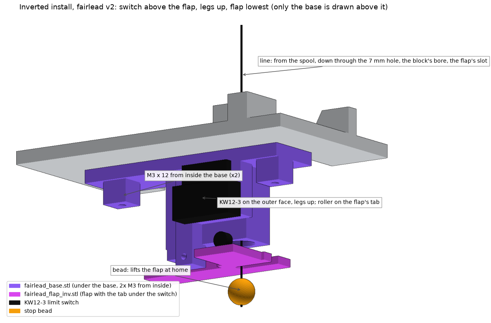

# 09 - Fairlead and limit switch (Rev C.1)

Replaces `line_guide.stl`. The bracket is unchanged and reused. Closes open item V10 (switch mount).
Source: `cad/fairlead.py`, pulled into `cad/generate.py`. Regenerate STLs and images with `tools\regen_cad.ps1`.

**Quantity: one fairlead body and one flap per build** (print a spare flap if you like).

## What it is

| Part | Job |
|---|---|
| `fairlead_body.stl` | Screws to the pad in the old line guide's spot (2x M3 countersunk from the ceiling side). Holds the fairlead, the hinge, the hard stop, the rest stop, and the switch plate |
| Fairlead (in the body) | Smooth, flared bore the line runs through: 9 mm wide at the top (spool side), 3.2 mm at the narrowest, 6 mm at the bottom. No sharp edges for the line to saw on. Centered on the spool's line channel |
| `fairlead_flap.stl` | Hinged bumper below the fairlead. The line passes loosely through an open slot, so it can be slipped in after the bead and swivel are tied. The prong on the switch side of the slot is 3.8 mm wide (was 1.2, too thin, owner 2026-09-27) |
| KW12-3 roller switch | Screws to the switch plate. Its roller rests just under the flap's tail |
| Hinge pin | M2 bolt, 16 to 20 mm: free in the flap, threads itself into the body |

## How it works

1. Spider away: the flap hangs level on its rest stop. The switch is open.
2. Rewind: the 8 mm stop bead rises and lifts the flap's free end. The flap pivots; its tail swings down onto the switch roller.
3. The switch clicks after about 2.3 mm of bead travel (2.6 mm at the roller). The firmware stops the motor.
4. If the motor keeps pulling, the flap lands flat against the fairlead's underside (the hard stop) after 3.3 mm of bead travel. The motor's pull goes into that face, not into the switch or the hinge pin.
5. Spider drops: gravity and the switch spring return the flap to its rest stop.

Measured in CAD: hard stop at 14.75 degrees; roller pushed 4.3 mm at the stop, 0.3 mm gap at rest, so about 4.0 mm of actual push against the switch's 2.6 mm to click plus 0.8 mm minimum overtravel. No collisions with the spool, bracket, servo or motor; 2 mm clearance to the spinning spool.

## Print

| File | Orientation | Settings |
|---|---|---|
| fairlead_body.stl | as exported (flat side down, 17 mm tall) | PLA, 4 walls, 40% gyroid, **no supports** (the bore and slots bridge) |
| fairlead_flap.stl | as exported (flat side down) | PLA or PETG, 4 walls, 100% rectilinear, brim 5 mm |

One flap is needed; a second is a spare.

## Assemble

1. Clean the fairlead bore with a 3 mm drill turned by hand. Run a scrap of the line through it; it must slide without catching. Sand the top flare smooth if it feels rough.
2. Fit the switch to the plate: **roller end toward the fairlead** (toward the spool), body on the side away from the plate's flat back. Two M2 screws through the plate's slots and the switch, nuts on the switch side. Leave them finger-tight.
3. Push the flap's knuckle into the gap below the fairlead and line up the holes. Drive an M2 bolt (16 to 20 mm) in from the flap's outer side: free through the flap (2.5 mm hole; drill it by hand if it drags), threading itself into the body. Stop before the head clamps the flap; it must swing down under its own weight.
4. Flap level on its rest stop: slide the switch up in its slots until the roller just touches the flap tail, then back it off about 0.3 mm (a piece of paper's thickness). Tighten.
5. Check by hand: lift the flap's free end. Click at about 2 mm; flap stops flat against the fairlead a moment later. Let go: it drops back, switch opens.
6. Screw the body to the pad: 2x **M3 countersunk (flat-head) screws, 8 to 10 mm**, put in from the ceiling side down through the x = -32 pad holes, heads flush with the ceiling face, cutting their own thread into the fairlead's rail (2.5 mm pilots). No glue (owner 2026-09-26). The pad holes need a 90 degree countersink so the heads sit flush: new bracket prints have it; on an already printed bracket, twist an 8 mm drill bit by hand in each of the two holes from the ceiling side until a screw head sits flush or just below.
7. Thread the line from the spool down through the fairlead, then slide it into the flap's slot from the free end. Bead, swivel, spider below as before.

## Inverted install: `fairlead_base.stl` and `fairlead_flap_inv.stl` (v2, 2026-09-28)

Owner's edits the same day: the line bore widened (4.0 mm throat, was 3.2; mouths 7 mm at the base and 9 mm at the flap, each flare 6 mm long); the switch plate solid with two self-tapping M2 holes instead of slots and nuts; the rest pad shortened 1.25 mm, so the flap hangs at 9.5 degrees at rest (was 1.75) and the roller sits about 3 mm clear of the tab until the bead lifts it.

Owner's redesign ask, 2026-09-28: the switch faces outward, its legs and wires point up toward the spool instead of hanging under the flap, and the flap is the lowest point. So the switch now sits above the flap on the block's outer side, legs up, and its roller rests on a tab added to the flap's free-end side. The bead lifts the free end; the tab lifts the roller. Source `fairlead_base()` and `flap_inv_local()` in `cad/inverted.py`. Stacking the switch above the flap takes about 30 mm under the base, so the flap hangs 32 mm under it (v1: 15 mm, with the switch hanging to 43).

Checked in the model 2026-09-28 (`python cad/inverted.py`): block and flap watertight; mounting face one plane; clear of every part (braces, radar, board box); line path clear through the base hole, the bore and the flap slot; hard stop 14.75 degrees; roller pushed 4.03 mm past touching (needs 3.4, same as v1); lowest points below the base: flap 37.3 at rest, block 32.7, switch 30.5; switch legs end 4.1 mm under the base; 2 mm clear of the spool; screw heads clear. Not printed or fitted yet.

| Step | What to do |
|---|---|
| Print | `fairlead_base.stl` (mounting face on the bed, 33 mm tall, no supports) and `fairlead_flap_inv.stl` (prints flat like the old flap). The old `fairlead_flap.stl` does not fit this block: it has no tab |
| Holes in the base | Same as before: 7 mm at x 25, z 45 (the line), 3.4 mm at x 32, z 28 and z 83 (block screws). Drawing `cad/bracket_footprint_inverted.svg`, 1:1 |
| Switch | KW12-3 on the block's outer face (the side away from the rod), lever and roller DOWN, legs UP toward the base. 2x **M2 x 12 screws** through the switch, threading straight into the plastic (no nuts, no slots: the switch position is fixed). Hole centres 6.5 mm from the switch plate's free edge (its top as printed) |
| Wires | Solder before mounting. The legs end about 4 mm under the base: lead the wires sideways off the legs, then round the base's far end to the board |
| Flap | M2 bolt, 20 mm, in from the rod side through the flap's knuckle and threaded into the hinge boss, not clamped. The tab goes under the roller |
| Screw on | 2x **M3 x 12** from inside the base (heads on the device side) into the block's 2.5 mm pilots. Flat face against the base's outer face |
| Line | From the spool's servo side down through the base hole, the bore, then the flap's slot |
| Check | Lift the flap's free end by hand: click at about 2 mm, stops flat against the block. Let go: it drops to its rest stop and the switch opens |

Heights change with v2: the bead at home sits about 196 mm below the ceiling (v1: 179), so the retracted spider hides behind a 10 in beam only if it is 28 mm tall or less, and the line between the spool and the flap is about 72 mm (v1: 55). Line length = (ceiling - 196) - (rest height + spider height + 30) + 72.

## Wiring

Bare KW12-3, three legs: COM to GND, NO to GPIO32, NC unused. Firmware pull-up: open = HIGH, pressed = LOW. Check with the web page; `liminv` if backwards.

## Known effects on other items

- **V14, answered by the geometry:** after the lock seat move lets the spool down up to 1/12 turn (about 13 mm of line), the bead drops off the flap and the switch reads **open** at rest. The firmware must not treat "open at rest" as "spider not home". Suggested rule: the last cycle ended with a switch stop, then a seat move, then idle = home.
- Ceiling install: the device now hangs about 36 mm lower (switch at y 112 vs old guide at y 76). Still hidden above the door head per doc 06 at 8 ft ceilings.
- Spider legs wider than about 50 mm may touch the switch at the top. Trim legs or angle them down.

## Unverified

- The KW12-3's operating point is taken from the owner's datasheet (2.6 mm pre-travel, 0.8 mm overtravel, 0.7 N). The slotted holes cover about plus or minus 2.5 mm of error.
- The M2 hinge bolt loosening over a season: a drop of threadlocker or CA on its thread in the body.
- Line wear in the PLA fairlead. Swap for a new print if a groove appears.
